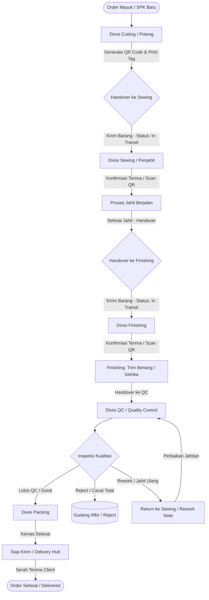

# 🧵 BRAINSTORMING & SYSTEM SPECIFICATION
## Aplikasi Manajemen & Tracking Produksi Garment (Berbasis Alur Ekspedisi / Barcode Scan)

---

## 1. Executive Summary & Latar Belakang Klien

### 1.1 Profil & Karakteristik Klien
- **Bidang Usaha**: Garment konveksi pakaian jadi (baju/kemeja/kaos/celana).
- **Latar Belakang Owner**: Memiliki pengalaman di bidang ekspedisi logistik (seperti Shopee Express/J&T), sehingga memiliki pemahaman intuitif yang sangat kuat terhadap konsep **Inbound → Hub Transit → Checkpoint Scan → Outbound → Handover Kurir → Buyer**.
- **Kondisi Eksisting**: Masih menggunakan pencatatan manual (kertas/WhatsApp/buku/Excel). Akibatnya sering terjadi *blind spot*—owner tidak mengetahui secara tepat posisi pesanan berada di divisi mana, siapa penanggung jawabnya (PIC), berapa jumlah yang selesai, berapa yang cacat (reject), dan kapan barang berpindah.
- **Tujuan Utama**: Membangun sistem web tracking berbasis workflow produksi yang **simpel, cepat, dan transparan** dengan mekanisme **Scan Barcode/QR Code** antar PIC setiap kali terjadi serah terima (handover), dapat diakses melalui **Smartphone (Mobile PWA)** untuk PIC lapangan dan **Laptop/Desktop** untuk Owner/Admin.

---

## 2. Metaphor & Mental Model: "Sistem Logistik Ekspedisi di Pabrik Garment"

Sistem ini mentransformasikan alur ekspedisi kurir menjadi alur manufaktur garmen:

| Konsep Ekspedisi (Logistik) | Ekuivalen di Garment Production | Fungsi dalam Sistem |
| :--- | :--- | :--- |
| **No. Resi (AWB)** | **No. Production Order (PO / QR Code)** | Identitas unik setiap batch pesanan / bundle pakaian |
| **Seller Create Order / Drop-off** | **Order Entry & Cutting (Potong Kain)** | Bahan baku dipotong sesuai pola, order diterbitkan & QR dicetak |
| **Pickup Hub / Sorting Center** | **Penjahit (Sewing Department)** | Penjahit menerima potongan kain dan merakit menjadi pakaian |
| **Transit / Manifest Antar Hub** | **Handover Antar Divisi (Transit)** | Serah terima resmi antar PIC dengan konfirmasi ganda (Double Confirm) |
| **Hub Tujuan (Destination Hub)** | **Finishing (Kancing, Gosok, Buang Benang)** | Proses pembersihan, pemasangan aksesoris, dan perapihan |
| **Quality Check & Sorting** | **QC (Quality Control)** | Pemisahan pakaian: **Lolos (Good)**, **Reject**, atau **Rework (Jahit Ulang)** |
| **Courier Out for Delivery** | **Packing & Siap Kirim** | Pengepakan plastik/karton dan persiapan ekspedisi ke klien |
| **Delivered to Buyer** | **Serah Terima ke Klien / Selesai** | Barang diterima klien dengan bukti tanda terima digital / status closed |

---

## 3. Workflow Produksi & State Machine



### 3.1 Detail Tiap Tahapan Alur:
1. **Order Creation & Cutting (Potong Kain)**:
   - Admin/PIC Cutting menginput detail SPK (Surat Perintah Kerja): Kode PO, Nama Klien, Jenis Produk, Target Selesai, Total Target Qty.
   - Sistem men-generate **QR Code PO**.
   - Setelah kain dipotong, PIC Cutting menginput qty hasil potong (contoh: target 500 pcs, hasil potong 500 pcs).
2. **Handover: Cutting ➔ Sewing**:
   - PIC Cutting memilih tujuan (Sewing), memilih PIC Penjahit yang ditugaskan, memasukkan Qty transfer, lalu klik **"Kirim Handover"**.
   - Status order berubah menjadi **In-Transit**.
3. **Penerimaan di Sewing (Double Confirmation)**:
   - PIC Penjahit menerima notifikasi serah terima di HP.
   - PIC Penjahit melakukan **Scan QR** atau klik **"Terima Barang"** setelah menghitung fisik kain.
   - Status resmi berpindah ke **In Sewing**.
4. **Sewing ➔ Finishing**:
   - Setelah pakaian dijahit, PIC Sewing mengajukan handover ke Finishing.
   - Mendukung **Partial Handover** (contoh: 500 pcs dikirim bertahap: 200 pcs di hari ke-1, 300 pcs di hari ke-2).
5. **Finishing ➔ QC (Quality Control)**:
   - PIC Finishing merapikan benang, gosok, pasang kancing/label, lalu handover ke QC.
6. **QC Inspection (Pemisahan 3 Jalur)**:
   - **Good (Lolos)**: Melanjutkan ke tahap Packing.
   - **Reject (Rusak Permanen/Cacat Kain)**: Dicatat kuantitas & alasannya, dipisahkan dari batch produksi.
   - **Rework (Bisa Diperbaiki)**: Barang dikembalikan ke PIC Sewing dengan catatan revisi (misal: "jahitan kerah miring 10 pcs"). Setelah diperbaiki, dikirim ulang ke QC.
7. **Packing & Dispatch / Delivery**:
   - Pakaian dikemas ke polybag/dus.
   - PIC Pengiriman mengonfirmasi serah terima ke kurir atau klien langsung.

---

## 4. Analisis Masalah Kritis & Solusi Sistem

### 4.1 Mekanisme Serah Terima: "Double Confirmation"
- **Masalah Lapangan**: PIC A mengaku sudah mengirim 500 pcs, tetapi PIC B mengaku hanya menerima 480 pcs. Terjadi saling lempar tanggung jawab.
- **Solusi Sistem**:
  1. PIC Pengirim membuat form handover: Masukkan Qty Kirim (misal: 500 pcs). Status: `WAITING_CONFIRMATION`.
  2. PIC Penerima wajib memvalidasi:
     - Jika sesuai: klik "Terima 500 pcs".
     - Jika ada selisih: input Qty Diterima (misal: 480 pcs) + Catatan Selisih.
  3. Audit log mencatat timestamp, user pengirim, user penerima, dan lokasi serah terima.

### 4.2 Penanganan Partial Quantity (Pengiriman Bertahap)
- **Masalah Lapangan**: Produksi garment jarang selesai sekaligus 100%. Misalnya PO 1.000 pcs, penjahit menyelesaikan 200 pcs per hari dan ingin langsung diteruskan ke finishing agar tidak menumpuk.
- **Solusi Sistem**:
  - Tiap stage melacak: `qty_target`, `qty_in_progress`, `qty_transferred`, dan `qty_remaining`.
  - PIC dapat mentransfer sebagian (partial transfer) tanpa menutup status order induk.

### 4.3 Alur Rework & Reject
- **Masalah Lapangan**: Jika ada baju yang jahitannya lepas, tidak bisa langsung dianggap selesai atau dibuang.
- **Solusi Sistem**:
  - Fitur inspeksi QC memiliki 3 input: `Qty Lolos`, `Qty Reject`, `Qty Rework`.
  - Input Rework otomatis mengenerate tiket "Rework Task" yang diarahkan kembali ke penjahit terkait dengan deskripsi perbaikan.

---

## 5. Role & Hak Akses Pengguna (RBAC)

| Role | Perangkat Utama | Hak Akses & Fitur |
| :--- | :--- | :--- |
| **Owner / Direktur** | Laptop & HP | - Melihat Full Production Dashboard & Realtime Bottleneck Pipeline.<br>- Akses laporan produktivitas PIC, defect rate, & durasi per tahap.<br>- Akses Audit Log & Riwayat Perjalanan PO. |
| **Admin Produksi** | Laptop / PC | - CRUD Data Master (Produk, Klien/Customer, Pengguna/PIC).<br>- Input Order / SPK Baru, Print Barcode/QR Sheet.<br>- Monitoring & Filter status seluruh produksi.<br>- Ekspor laporan & manajemen pembatalan order. |
| **PIC Cutting** | HP (Mobile PWA) | - Scan QR / Lihat daftar tugas Cutting.<br>- Input hasil potong.<br>- Handover hasil potong ke Sewing (Pilih PIC Sewing & Qty). |
| **PIC Sewing (Penjahit)** | HP (Mobile PWA) | - Terima barang masuk dari Cutting (Konfirmasi Qty).<br>- Update progres jahit.<br>- Menerima tiket Rework dari QC.<br>- Handover barang jadi ke Finishing. |
| **PIC Finishing** | HP (Mobile PWA) | - Terima barang dari Sewing.<br>- Catat proses finishing (trimming, ironing, pasang aksesoris).<br>- Handover ke QC. |
| **PIC QC** | HP / Tablet | - Terima barang dari Finishing.<br>- Scan QR order & input hasil inspeksi: Qty Good, Reject, Rework.<br>- Teruskan barang lolos ke Packing. |
| **PIC Packing & Delivery** | HP (Mobile PWA) | - Terima barang Good dari QC.<br>- Packing per lusin/dus.<br>- Konfirmasi pengiriman / serah terima ke klien. |

---

## 6. Desain Antarmuka Pengguna (UI/UX)

### 6.1 Mode Mobile (Fokus PIC Lapangan / PWA)
- **Desain Ringkas & Praktis**: Didesain agar nyaman digunakan pekerja di lantai produksi dengan satu tangan.
- **Floating Action Button (FAB) / Tab Bar Menengah**: Tombol besar **"SCAN QR"** di tengah bawah layar.
- **Tab Navigasi Mobile**:
  1. `Tugas Saya`: Daftar order yang sedang berada di divisi PIC aktif.
  2. `Barang Masuk`: Notifikasi handover dari divisi sebelumnya yang butuh konfirmasi terima.
  3. `Scan QR`: Pembaca kamera instan untuk memindai label QR pada bundel pakaian.
  4. `Riwayat`: Riwayat serah terima yang pernah dilakukan PIC hari ini.

### 6.2 Mode Desktop / Laptop (Fokus Admin & Owner)
- **Sidebar Menu Interaktif**: Dapat di-toggle / collapse secara halus (*smooth transition*).
- **Production Pipeline Kanban / Step Progress Tracker**: Menampilkan visualisasi persentase order yang sedang berada di Cutting, Sewing, Finishing, QC, dan Siap Kirim.
- **Datatable Responsif**: Dilengkapi Realtime Debounce Search (300ms), opsi limit data (10, 25, 50, 100), pagination lengkap, dan modal pop-up untuk Create/Edit.

---

## 7. Arsitektur Teknis & Standar Kode (Sesuai AGENTS.md)

### 7.1 Tech Stack Wajib
- **Frontend**:
  - React (Vite + JSX)
  - PWA Support (`vite-plugin-pwa` dengan manifest & service worker untuk instalasi di Android/iOS)
  - Styling: TailwindCSS (Modern, Clean UI, Palette slate/indigo bernuansa industrial modern)
  - Icons: `lucide-react`
  - Feedback: `react-hot-toast` untuk Toast Alert, Confirm Dialog, Success, Error
  - QR Code Scanner: `html5-qrcode` (kamera ponsel & upload gambar QR)
  - QR Code Generator: `qrcode.react`
  - Centralized API Architecture:
    - `src/utils/endpoints.js` (Seluruh endpoint API terpusat, dilarang hardcode string URL)
    - `src/utils/api.js` (Axios instance terkonfigurasi dengan `VITE_API_URL` dan token interceptor)
    - `src/utils/request.js` (Helper request reusable dengan penanganan error terstandar)
- **Backend**:
  - Express.js (Single server file di `backend/server.js`)
  - Database: MySQL (menggunakan driver `mysql2/promise`)
  - File Upload: `multer` ke direktori khusus `uploads-management-garment/`
  - Format Response API Standar:
    ```json
    {
      "success": true,
      "message": "Berhasil mengambil data",
      "data": [],
      "pagination": {
        "page": 1,
        "limit": 10,
        "total": 100,
        "totalPages": 10
      }
    }
    ```
- **Database Export**:
  - `sql/database.sql` berisi skrip DDL lengkap beserta data awal (seeder admin, PIC demo, master produk, dan contoh order alur garmen).

---

## 8. Desain Struktur Database (MySQL DDL Blueprint)

```sql
-- 1. Tabel Master Peran & Pengguna
CREATE TABLE roles (
  id INT AUTO_INCREMENT PRIMARY KEY,
  name VARCHAR(50) NOT NULL UNIQUE, -- 'owner', 'admin', 'cutting', 'sewing', 'finishing', 'qc', 'packing'
  display_name VARCHAR(100) NOT NULL,
  created_at TIMESTAMP DEFAULT CURRENT_TIMESTAMP
);

CREATE TABLE users (
  id INT AUTO_INCREMENT PRIMARY KEY,
  role_id INT NOT NULL,
  name VARCHAR(100) NOT NULL,
  username VARCHAR(50) NOT NULL UNIQUE,
  password VARCHAR(255) NOT NULL,
  phone VARCHAR(20),
  is_active BOOLEAN DEFAULT TRUE,
  created_at TIMESTAMP DEFAULT CURRENT_TIMESTAMP,
  updated_at TIMESTAMP DEFAULT CURRENT_TIMESTAMP ON UPDATE CURRENT_TIMESTAMP,
  FOREIGN KEY (role_id) REFERENCES roles(id)
);

-- 2. Master Pelanggan & Produk
CREATE TABLE customers (
  id INT AUTO_INCREMENT PRIMARY KEY,
  name VARCHAR(150) NOT NULL,
  phone VARCHAR(50),
  address TEXT,
  created_at TIMESTAMP DEFAULT CURRENT_TIMESTAMP
);

CREATE TABLE products (
  id INT AUTO_INCREMENT PRIMARY KEY,
  code VARCHAR(50) NOT NULL UNIQUE,
  name VARCHAR(150) NOT NULL,
  category VARCHAR(100), -- Kemeja, Kaos, Celana, Jaket, dll
  description TEXT,
  created_at TIMESTAMP DEFAULT CURRENT_TIMESTAMP
);

-- 3. Transaksi Order / SPK Produksi
CREATE TABLE orders (
  id INT AUTO_INCREMENT PRIMARY KEY,
  order_number VARCHAR(50) NOT NULL UNIQUE, -- Contoh: ORD-2026-0001
  customer_id INT NOT NULL,
  product_id INT NOT NULL,
  target_qty INT NOT NULL,
  deadline DATE,
  current_stage ENUM('cutting', 'sewing', 'finishing', 'qc', 'packing', 'delivered', 'completed', 'cancelled') DEFAULT 'cutting',
  status ENUM('pending', 'in_progress', 'completed', 'cancelled') DEFAULT 'in_progress',
  notes TEXT,
  created_by INT,
  created_at TIMESTAMP DEFAULT CURRENT_TIMESTAMP,
  updated_at TIMESTAMP DEFAULT CURRENT_TIMESTAMP ON UPDATE CURRENT_TIMESTAMP,
  FOREIGN KEY (customer_id) REFERENCES customers(id),
  FOREIGN KEY (product_id) REFERENCES products(id),
  FOREIGN KEY (created_by) REFERENCES users(id)
);

-- 4. Serah Terima Antar PIC / Transit (Ekspedisi Model)
CREATE TABLE handovers (
  id INT AUTO_INCREMENT PRIMARY KEY,
  order_id INT NOT NULL,
  handover_code VARCHAR(50) NOT NULL UNIQUE, -- HND-202609-0001
  from_stage ENUM('cutting', 'sewing', 'finishing', 'qc', 'packing') NOT NULL,
  to_stage ENUM('sewing', 'finishing', 'qc', 'packing', 'delivered') NOT NULL,
  from_user_id INT NOT NULL,
  to_user_id INT NULL, -- Bisa spesifik PIC atau sembarang PIC di stage tujuan
  qty_sent INT NOT NULL,
  qty_received INT DEFAULT 0,
  status ENUM('in_transit', 'received', 'rejected', 'partial') DEFAULT 'in_transit',
  sent_at TIMESTAMP DEFAULT CURRENT_TIMESTAMP,
  received_at TIMESTAMP NULL,
  notes TEXT,
  discrepancy_reason TEXT,
  FOREIGN KEY (order_id) REFERENCES orders(id),
  FOREIGN KEY (from_user_id) REFERENCES users(id),
  FOREIGN KEY (to_user_id) REFERENCES users(id)
);

-- 5. Quality Control & Rework Record
CREATE TABLE qc_inspections (
  id INT AUTO_INCREMENT PRIMARY KEY,
  order_id INT NOT NULL,
  inspector_id INT NOT NULL,
  qty_checked INT NOT NULL,
  qty_passed INT NOT NULL,
  qty_reject INT DEFAULT 0,
  qty_rework INT DEFAULT 0,
  reject_reason TEXT,
  rework_target_stage ENUM('cutting', 'sewing', 'finishing') DEFAULT 'sewing',
  rework_status ENUM('pending', 'repaired', 're_checked') DEFAULT 'pending',
  notes TEXT,
  created_at TIMESTAMP DEFAULT CURRENT_TIMESTAMP,
  FOREIGN KEY (order_id) REFERENCES orders(id),
  FOREIGN KEY (inspector_id) REFERENCES users(id)
);

-- 6. Audit Trail & Production Event Logs
CREATE TABLE production_logs (
  id INT AUTO_INCREMENT PRIMARY KEY,
  order_id INT NOT NULL,
  stage ENUM('cutting', 'sewing', 'finishing', 'qc', 'packing', 'delivered') NOT NULL,
  action VARCHAR(100) NOT NULL, -- 'CUTTING_COMPLETED', 'HANDOVER_SENT', 'HANDOVER_ACCEPTED', 'QC_PASSED', etc.
  actor_id INT NOT NULL,
  qty_affected INT DEFAULT 0,
  description TEXT,
  created_at TIMESTAMP DEFAULT CURRENT_TIMESTAMP,
  FOREIGN KEY (order_id) REFERENCES orders(id),
  FOREIGN KEY (actor_id) REFERENCES users(id)
);
```

---

## 9. Pemetaan Endpoint API Terpusat (`endpoints.js`)

Sesuai aturan ketat pada **AGENTS.md**, seluruh pemanggilan API didefinisikan secara terpusat:

```javascript
export const API_ENDPOINTS = {
  AUTH: {
    LOGIN: "/auth/login",
    PROFILE: "/auth/profile",
  },
  DASHBOARD: {
    STATS: "/dashboard/stats",
    PIPELINE: "/dashboard/pipeline",
    RECENT_ACTIVITIES: "/dashboard/recent-activities",
  },
  ORDERS: {
    LIST: "/orders",
    DETAIL: (id) => `/orders/${id}`,
    CREATE: "/orders",
    UPDATE: (id) => `/orders/${id}`,
    DELETE: (id) => `/orders/${id}`,
    TRACKING: (id) => `/orders/${id}/tracking`,
    BY_NUMBER: (number) => `/orders/scan/${number}`,
  },
  HANDOVERS: {
    LIST: "/handovers",
    CREATE: "/handovers",
    RECEIVE: (id) => `/handovers/${id}/receive`,
    PENDING_INCOMING: "/handovers/incoming",
  },
  QC: {
    LIST: "/qc",
    CREATE: "/qc",
    REWORKS: "/qc/reworks",
  },
  CUSTOMERS: {
    LIST: "/customers",
    CREATE: "/customers",
    UPDATE: (id) => `/customers/${id}`,
    DELETE: (id) => `/customers/${id}`,
  },
  PRODUCTS: {
    LIST: "/products",
    CREATE: "/products",
    UPDATE: (id) => `/products/${id}`,
    DELETE: (id) => `/products/${id}`,
  },
  USERS: {
    LIST: "/users",
    CREATE: "/users",
    UPDATE: (id) => `/users/${id}`,
    DELETE: (id) => `/users/${id}`,
  },
  REPORTS: {
    SUMMARY: "/reports/summary",
    PIC_PRODUCTIVITY: "/reports/pic-productivity",
  }
};
```

---

## 10. Fitur MVP vs Fitur Fase Lanjutan

### ✅ Fitur Masuk MVP (Fase 1 - Siap Pakai & Cepat)
1. **Autentikasi & Multi-Role**: Owner, Admin, PIC Divisi (Cutting, Sewing, Finishing, QC, Packing).
2. **Master Data**: Pelanggan, Produk Pakaian, Akun PIC.
3. **Manajemen Order Produksi**: Buat SPK/Order, generate otomatis nomor PO & QR Code, cetak label barcode/QR.
4. **Alur Serah Terima (Handover) Realtime**:
   - Pengiriman barang antar tahap.
   - Konfirmasi ganda penerima (terima / catat selisih).
   - Penanganan pengiriman bertahap (partial qty).
5. **Kamera QR Code Scanner**:
   - Pemindaian langsung dari kamera HP atau laptop.
   - Deteksi kode PO langsung membuka form aksi serah terima atau cek status.
6. **QC & Rework Tracker**:
   - Catat qty lolos, qty cacat (reject), dan qty jahit ulang (rework).
7. **Tracking Timeline ala Ekspedisi**:
   - Visual step progress per order (jam perpindahan, nama PIC, jumlah pcs).
8. **Dashboard Owner & Admin**:
   - Statistik total order, posisi tumpukan order (*bottleneck*), dan riwayat aktivitas terkini.
9. **Standar AGENTS.md Lengkap**:
   - Modal Form untuk Create/Edit, Confirm Dialog untuk Hapus, Debounce Search 300ms, Pagination API (10/25/50/100).
   - Dukungan Progressive Web App (PWA) dapat di-install di layar HP.

### ⏳ Fitur Fase 2 (Pengembangan Mendatang / Diluar Scope MVP)
- Manajemen stok bahan baku (kain per roll, benang, kancing, resleting).
- Perhitungan upah borongan per PIC (payroll piece-rate).
- Integrasi bot WhatsApp untuk notifikasi otomatis serah terima atau reject QC.
- Multi-pabrik / multi-cabang.
